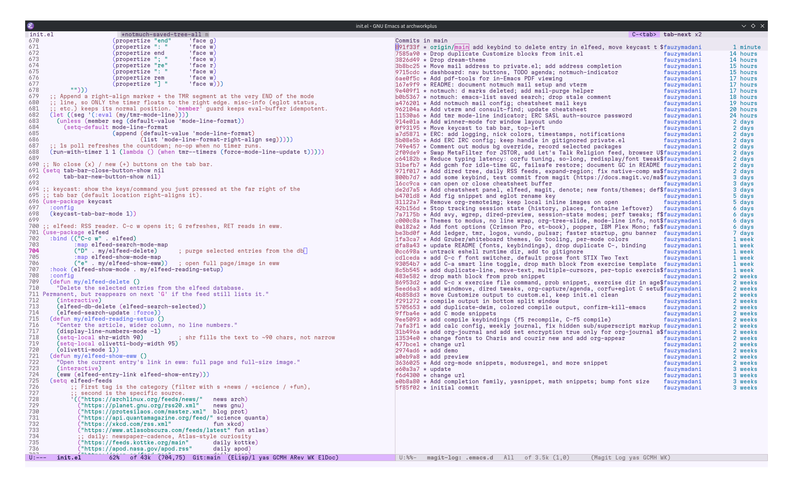

  
  &nbsp;&nbsp;&nbsp;&nbsp;
  

  # .emacs.d

  Personal Emacs config — built for math note-taking with Org mode and LaTeX preview.

https://github.com/user-attachments/assets/79fcb056-3b84-4de0-b281-b8b73a2ab7db

## Highlights

- **Org + LaTeX preview** — tecosaur's org fork with live SVG math rendering
- **cdlatex** — fast math input with custom symbol bindings
- **Mixed pitch** — STIX Two Text for prose (switch live with `C-c f`), Latin Modern Math for equations
- **Olivetti** — focused writing column
- **Consult + Embark + Marginalia** — enhanced navigation and search
- **YASnippet** — math snippets (`frac`, `int`, `sum`, `lim`, `mat`, `begin`, …)
- **Dated exercise files** — `C-c x` opens a templated math exercise, `C-u C-c x` per topic
- **Editing extras** — duplicate line, move line, multiple cursors, smart line start
- **C tooling** — corfu completion + eglot/clangd (jump-to-def, errors, docs)

## Requirements

Fonts (install to `~/.local/share/fonts` or via the package manager, then `fc-cache -f`):

| Font | Role | Required? |
|------|------|-----------|
| Iosevka Nerd Font Mono | default + code | yes |
| STIX Two Text | default prose (Org) | yes |
| EB Garamond, Charis | prose alternatives (`C-c f`) | optional |
| Latin Modern Math | math previews/export | ships with TeX Live |

Other tools: **TeX Live** (LaTeX preview + PDF export), **clangd** (C LSP).

## Keybindings

| Key | Action |
|-----|--------|
| `C-c i` | Insert inline math `\(\)` |
| `C-c d` | Insert display math `\[\]` |
| `C-c a` | Insert align environment |
| `C-c c` | Org capture |
| `C-c x` | Open today's exercise file (`C-u` prefix: per topic) |
| `C-x a` | Org agenda |
| `C-c n` | New org-journal entry |
| `C-c f` | Switch prose font (STIX / EB Garamond / Charis) |
| `C-c t` | Toggle light/dark theme |
| `C-,` | Duplicate line (or region) |
| `M-p` / `M-n` | Move line/region up / down |
| `C->` / `C-<` | Add cursor at next / previous match |
| `C-c m` | Add cursor to all matches |
| `C-a` | Smart line start (indentation ↔ column 0) |
| `<f5>` / `C-<f5>` | Recompile / compile |
| `C-s` | Live search in buffer (consult) |
| `C-x b` | Switch buffer with preview (consult) |
| `M-g g` | Go to line (consult) |
| `C-.` | Action menu on thing at point (embark) |
| `C-;` | Quick action on thing at point (embark-dwim) |

## Snippets

Snippet files live in `snippets/org-mode/`. Add new ones by dropping files there.
